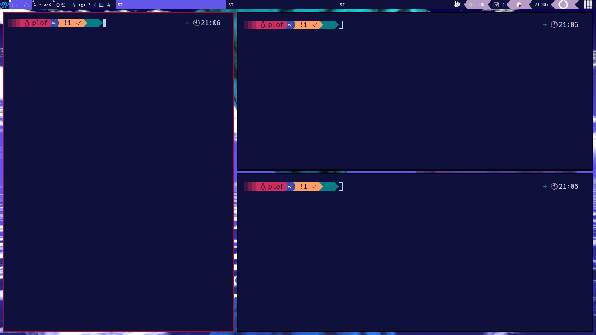
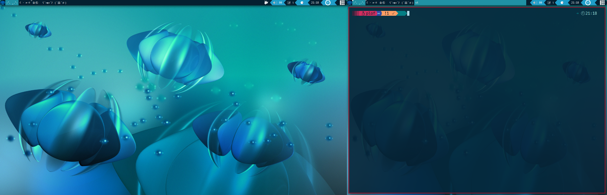
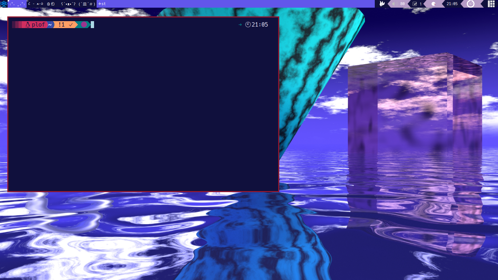
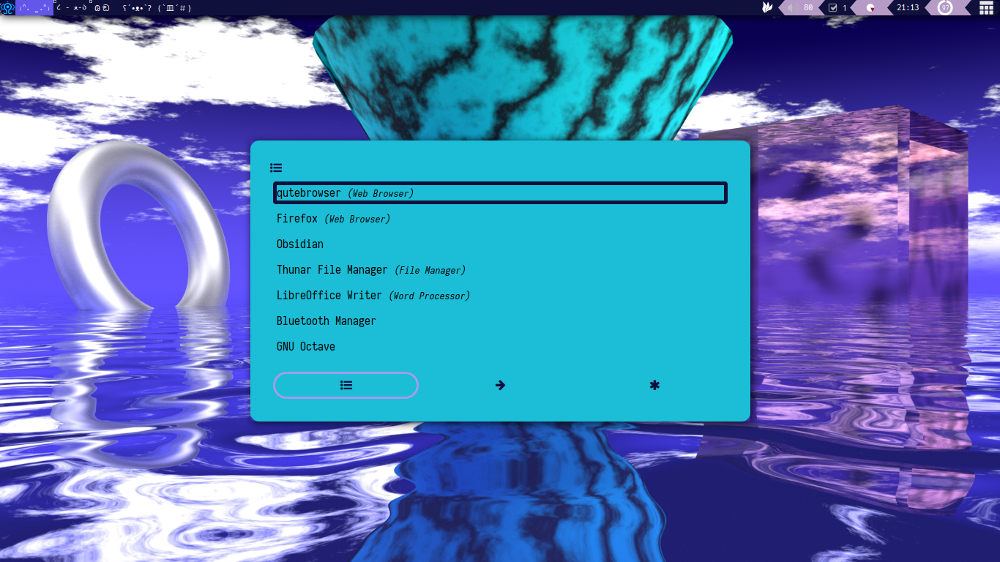
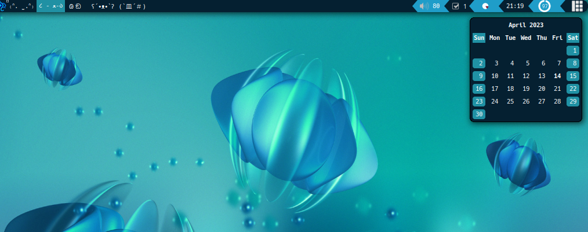

My awesomeWM build

Features

- Pywal colorscheme sync

- Rofi Scripts for
    + MPD
    + Execute Programs
    + Volume
    + Brightess
    + Power

- Widgets
    + TODO
    + Volume
    + Time
    + Ram and cpu usage
    + Calendar

### TODO

- Configure Keybindings
- Feedback when changing screen
